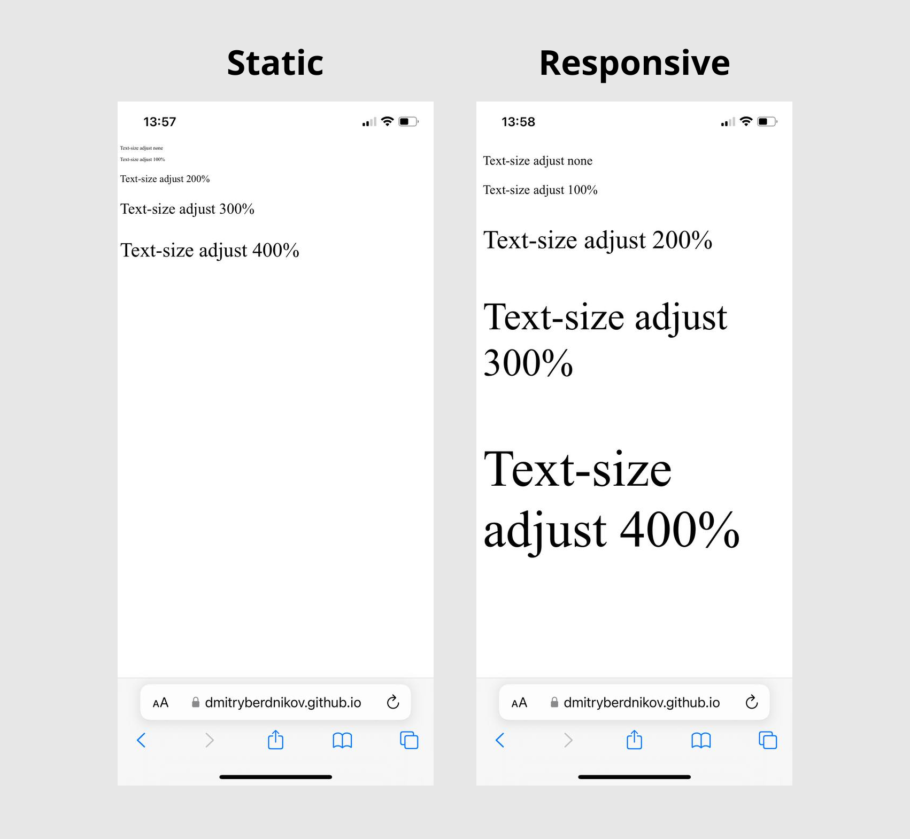
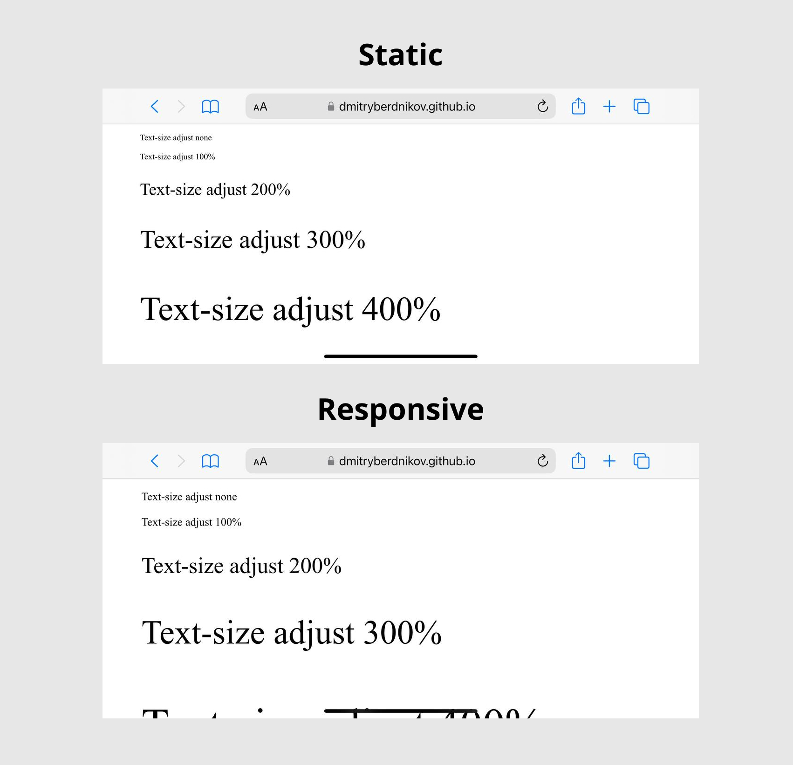
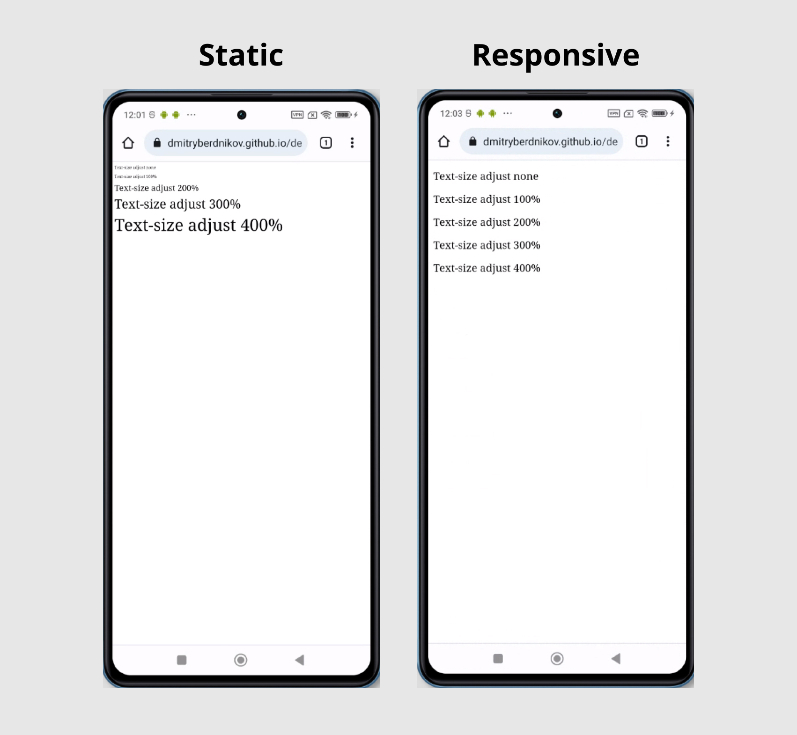

# CSS: text-size-adjust

## Demos:
* [Static viewport 1000 width](https://dmitryberdnikov.github.io/demos/text-size-adjust/viewport-static)
* [Responsive viewport](https://dmitryberdnikov.github.io/demos/text-size-adjust/viewport-responsive)

## Tested devices

### Iphone 12, IOS 16.5.1, Safari (real device)
#### Portrait orientation

#### Landscape orientation

### Redmi Note 10S, Android 12, Chrome (real device)
No difference

### Redmi Note 12 Pro, Android 12, Chrome (browserstack)
#### Portrait orientation

#### Landscape orientation

